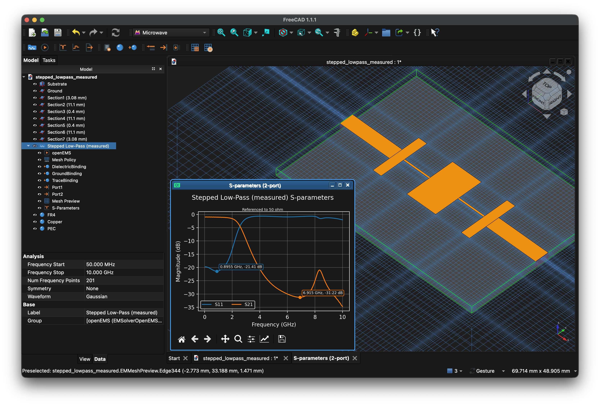

# Microwave Workbench

[](https://github.com/mishka-zz/freecad-microwave/actions/workflows/tests.yml)

A FreeCAD workbench for high-frequency electromagnetic simulation and
design.

Model high-frequency RF devices in FreeCAD, assign materials and boundary
conditions, define ports, configure solver settings, and run simulations.
Extracted S-parameters (`EMSParameters`) are stored directly in the FreeCAD
document database and can be plotted, analyzed via TDR, or exported to
Touchstone format.

Target applications include antennas, planar and waveguide filters,
couplers, transmission lines, transitions, packaging, cavities, and EMC
shielding.

**Status: Developer Preview.**



## Architecture

- **Document-centric model**: Geometry, materials, ports, excitation, and
  mesh policies are represented as native FreeCAD document objects
  (`App::FeaturePython`), independent of specific solver implementations.
- **Pluggable solver adapters**: Each backend adapter validates models
  against its capabilities, generates native solver inputs, executes
  simulations in a subprocess, and parses results back into document
  objects.
- **Standardized results**: Extracted network parameters (`EMSParameters`)
  use standard scikit-rf substrates for plotting, time-domain
  reflectometry (TDR), and Touchstone export.

## Solvers

| Solver | Numerical Method | Status | Target Applications |
|---|---|---|---|
| **openEMS** | FDTD (Time Domain) | **Supported** | Broadband sweeps, planar circuits, 3D structures |
| **Palace** | FEM (Frequency Domain) | Planned | High-Q resonators, eigenmode analysis, curved geometry |
| **NEC2** | Method of Moments (Wires) | Considered | Wire antennas, thin-wire arrays |
| **scuff-em** | Surface Integral (MoM) | Considered | Planar conductors with implicit substrates, periodic structures |
| **FasterCap + FastHenry** | Boundary Element (BEM) | Considered | Quasistatic RLCG extraction for SPICE interconnect models |
| **OpenParEM2D** | 2D FEM | Considered | 2D transmission line cross-section analysis and impedance synthesis |

## Simulation Results and Metrics

| Result Type | Description | Status |
|---|---|---|
| **S-parameters** | Full $N \times N$ matrix versus frequency, normalized to fixed $Z_0$ or modal impedance; Touchstone export (`.sNp`) | **Supported** |
| **Impedance profile (TDR)** | Step response reflection converted to characteristic impedance versus distance ($Z(d)$) or time ($Z(t)$) | **Supported** |
| **Far field** | Antenna gain, directivity, axial ratio, 2D/3D radiation patterns | Planned |
| **Field maps** | 2D planar and 3D volumetric field distribution exports (VTK format) | Planned |
| **Eigenmodes** | Resonant frequencies, loaded/unloaded Q-factors, modal patterns | Planned |
| **Scalar parameters** | Resonance frequency, bandwidth, insertion loss, return loss | Planned |

Every result dataset stores solver provenance: solver and adapter
versions, input envelope SHA-256 hash, elapsed runtime, and per-port
residual tail share.

## Modeling Capabilities

| Feature | Supported | Planned / Limitations |
|---|---|---|
| **Ports** | Microstrip, lumped elements (resistors/loads), rectangular waveguide | Differential / mixed-mode ports, coaxial TEM ports |
| **Materials** | Isotropic dielectrics, lossy dielectrics, PEC, 2D conducting sheets (`ConductingSheet`), TOML catalogs | Dispersive multi-pole models (Debye/Drude/Lorentz), anisotropic substrates |
| **Boundaries** | Absorbing (PML, Mur), conducting walls (PEC, PMC) | Periodic / Floquet boundary conditions |
| **Excitation** | Broadband Gaussian pulse on discrete and waveguide ports | Plane-wave incident excitation (RCS) |
| **Geometry** | 3D CAD solids, 2D planar sheets, curved polyhedra with automatic 0.5-cell offset correction | Offset correction is not applied to curved 2D conductor sheets |
| **Parametric Studies** | Single-run simulations | FreeCAD Spreadsheet / VarSet parametric sweeps and optimization |

## Metrology and Verification

Solver accuracy is verified against closed-form analytic standards and
published experimental measurements:
- Microstrip transmission lines verified against Hammerstad (1975) closed
  forms.
- WR-42 rectangular waveguide verified against modal phase constants and
  energy conservation ($|S_{11}|^2 + |S_{21}|^2 = 1$).
- Symmetric stripline verified against conformal mapping solutions.
- Stepped stripline TDR profiles verified against exact TEM impedances.
- Cylindrical and spherical cavity resonators verified against Bessel
  roots.
- Stepped-impedance low-pass filter verified against published physical VNA
  measurements.

Acceptance gates apply Eça & Hoekstra grid refinement studies to confirm
numerical convergence. Test tolerances are matched to the known accuracy of
the reference standard (e.g. 1% for Hammerstad). A passing gate indicates
agreement within the reference's physical uncertainty band, rather than
checking that numerical outputs remain frozen.

## Documentation

Detailed guides are available in [`docs/`](docs/README.md):
- [The Document Model](docs/model.md): Document hierarchy, analyses, and
  symmetry.
- [Drawing the Device](docs/geometry.md): CAD modeling rules and geometry
  validation.
- [Materials](docs/materials.md): Material definitions, catalogs, and
  surface impedance.
- [Ports](docs/ports.md): Microstrip, lumped, and rectangular waveguide
  ports.
- [Meshing](docs/meshing.md): Discretization policies, Yee grids, and
  refinement.
- [Running Simulations](docs/running.md): Task panel controls, solver
  settings, and CLI driver.
- [Results](docs/results.md): S-parameter plotting, TDR profiles, and
  Touchstone export.
- [Metrology](docs/metrology.md): Verification gates, convergence tests,
  and accuracy metrics.

See [`CHANGELOG.md`](CHANGELOG.md) for version release notes.

## Installation

### 1. Workbench Installation
Requires FreeCAD 1.0 or newer, on Python 3.11 or newer. Both are checked at
startup: below either floor the workbench prints why it is not loaded and never
appears in the workbench selector.

The FreeCAD release does not settle the Python. A FreeCAD is built against
whatever Python its packager chose. `sys.version` in FreeCAD's Python console
says which one a build embeds.

Copy or symlink this directory into FreeCAD's user `Mod/` folder:
- **Linux**: `~/.local/share/FreeCAD/Mod/`
- **macOS**: `~/Library/Application Support/FreeCAD/Mod/`
- **Windows**: `%APPDATA%\FreeCAD\Mod\`

To find your user directory, run `FreeCAD.getUserAppDataDir()` in FreeCAD's
Python console. Restart FreeCAD and select **Microwave** from the workbench
selector.

*Note: FreeCAD requires addon workbenches to be installed in `Mod/` to
restore document object proxies correctly.*

### 2. openEMS Solver Installation
The openEMS solver is required only for solving. CAD modeling, material
assignment, mesh generation, Yee grid preview, and pre-flight validation
work with no openEMS installed.

To run simulations, install openEMS and its Python interface:
1. Install [openEMS binaries and dependencies](
   https://docs.openems.de/install.html).
2. Install the [openEMS Python interface](
   https://docs.openems.de/python/install.html).

If openEMS is installed in a Python environment separate from FreeCAD,
specify the interpreter path in the solver object's `SolverPython` property
or set the `$MICROWAVE_OPENEMS_PYTHON` environment variable.

### 3. Python Dependencies
The host FreeCAD Python environment requires:
- `numpy` (geometry processing and Yee meshing)
- `scipy`, `pandas`, `typing_extensions` (S-parameter processing)

Optional dependency:
- `matplotlib` (for S-parameter and TDR plotting; modeling, meshing,
  pre-flight, solving, and Touchstone export work without it)

*A compatible version of `scikit-rf` is bundled internally under
`Microwave/_vendor/`.*

## Quick Start

1. Open [`examples/stub_notch.FCStd`](examples/stub_notch.FCStd).
2. Double-click the **EM Analysis** container in the tree view to open the
   task panel.
3. Click **Run**. The frequency response plot appears when time-stepping
   completes.

### Example Models

- [`examples/stub_notch.FCStd`](examples/stub_notch.FCStd):
  5 GHz microstrip notch filter with an open-circuit stub.
- [`examples/stepped_line.FCStd`](examples/stepped_line.FCStd):
  Stepped-impedance transmission line with TDR impedance profile plotting.
- [`examples/stepped_lowpass_synthesised.FCStd`](
  examples/stepped_lowpass_synthesised.FCStd):
  5-section Butterworth stepped-impedance low-pass filter.
- [`examples/stepped_lowpass_measured.FCStd`](
  examples/stepped_lowpass_measured.FCStd):
  Microstrip low-pass filter benchmarked against published VNA measurements.
- [`examples/microstrip_50ohm.FCStd`](examples/microstrip_50ohm.FCStd):
  50 Ω microstrip line benchmarked against Hammerstad closed forms.
- [`examples/stripline_50ohm.FCStd`](examples/stripline_50ohm.FCStd):
  50 Ω symmetric stripline benchmarked against conformal mapping.

### General Simulation Workflow

| Step | Action | Description |
|---|---|---|
| 1 | **Draw Geometry** | Construct CAD solids (`Part` workbench) or 2D sketches. |
| 2 | **Create EM Analysis** | Create study container, solver object, and mesh policy; set frequency range. |
| 3 | **Assign Materials** | Add materials from catalog and bind them to geometry. |
| 4 | **Add Ports** | Select conductor faces/edges and add Microstrip, Lumped, or Waveguide ports. |
| 5 | **Update Mesh** | Generate and inspect the Yee discretization grid. |
| 6 | **Run Simulation** | Execute FDTD solver and inspect extracted S-parameters and TDR profiles. |

## Running Tests

Execute the automated test suite from the repository root:

```bash
# Fast unit tests (no external solver or CAD kernel required)
python3 -m pytest -m "not slow"

# Pre-commit acceptance suite (runs single-mesh verification gates)
python3 -m pytest -m "slow and not release"

# Full metrology acceptance suite (includes multi-mesh refinement studies)
python3 -m pytest -m slow -s | grep GATE

# Generate full metrology accuracy report
python3 -m tests.gate_report
```

The CI test badge reflects the fast test suite (`not slow`), the linter, the
type checker, and a clean-environment import check. Acceptance gates require a compiled openEMS
installation and are not run in standard CI. A passing CI badge verifies
internal software consistency rather than physical accuracy.

## Contributing

While the version is `0.0.x`, please open a discussion rather than a pull
request. Interfaces and internal layers are actively being refined, so a
patch may land against code being rewritten. This will be revisited at
**0.1.0**.

This workbench is written with an LLM. The motivation is twofold: no
integrated electromagnetic workbench currently exists for FreeCAD, and
Microwave is intended to serve as a working reference implementation for a
future LLM-free native workbench, if someone ever decides to write one.

Patches written with an LLM are welcome on the same terms as any other:
small, modular, and understood by whoever sends them. A large diff that has
not been reviewed costs more to evaluate than to write from scratch.

Human review is the scarce resource here. The most valuable
contributions are benchmark runs on devices whose physical answers are
already known: what was drawn in CAD, what the solver returned, and what
you expected from theory or measurements. Equally valuable are unhelpful
refusal messages, incorrect bench terminology, or physical arguments
showing where an answer is wrong. Where you see a fix, explaining the
reasoning in words is often more effective than submitting code - once
the physics and geometry constraints are clear, implementing the change
is straightforward.

## License

Copyright (C) 2026 Mike Volokhov.

LGPL-2.1-or-later - the same as FreeCAD core, so this could go upstream. Full
text in [`LICENSE`](LICENSE). The *or-later* matters: LGPL-2.1-only is
incompatible with GPLv3, and openEMS is GPLv3.

`Microwave/_vendor/` holds a verbatim copy of scikit-rf, which is
BSD-3-Clause; its licence travels with it in `LICENSE.skrf.txt`.
