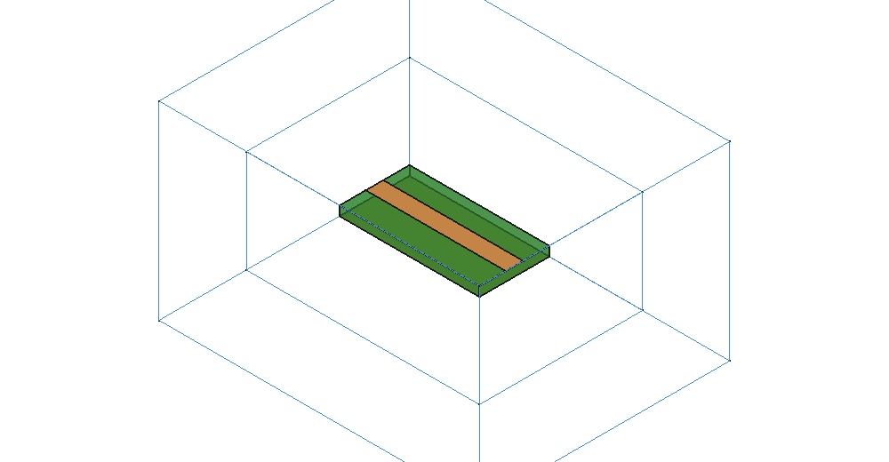
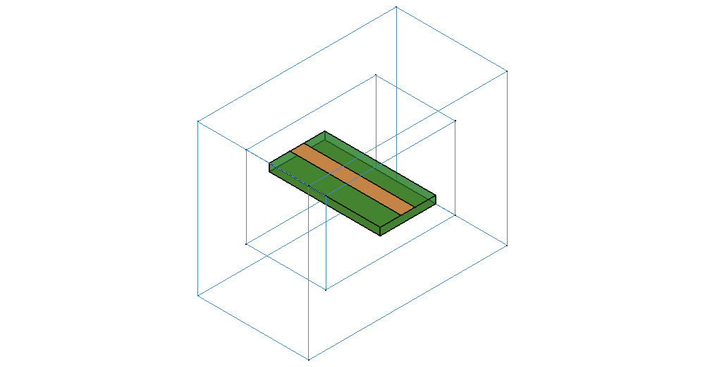
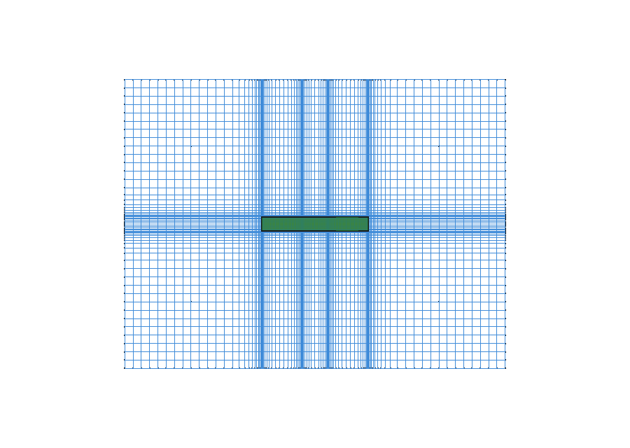

# Meshing

Mesh generation consists of two distinct layers:
1. **Mesh policy (solver-neutral)**: Defines discretization resolution goals
   per wavelength and feature geometry.
2. **Grid generation (solver-specific)**: The openEMS adapter generates an
   orthogonal finite-difference Yee grid conforming to the policy.

The mesh policy uses the generic term *element*. The openEMS adapter
generates rectangular Yee *cells*.

## Mesh Policy

### Sizing parameters

<!-- defaults: EMMeshPolicy -->
| Property | Default | Description |
|---|---|---|
| `ElementsPerWavelength` | 20 | Target elements per wavelength in the slowest medium in the model (highest `epsilon_r * mu_r`) at `FrequencyStop` |
| `EdgeRefinement` | 6 | Refinement factor for elements adjacent to conductor edges |
| `MaxGrowthRatio` | 1.3 | Maximum cell size expansion ratio between adjacent elements |
| `MinElementsAcross` | 9 | Minimum element count across dielectric thickness |
| `MinElementSize` | 0 | Minimum allowed element size in millimetres (0 = automatic) |
| `CurveTolerance` | 0 | Maximum allowed surface deviation on curved geometry in mm (0 = CAD default) |

Element sizing is defined relative to electrical wavelength rather than fixed
millimetre dimensions, automatically adapting resolution when frequency or
substrate permittivity changes:

```
lambda_min          = wavelength(slowest_dielectric, FrequencyStop)
bulk_cell_size      = lambda_min / ElementsPerWavelength
conductor_cell_size = bulk_cell_size / EdgeRefinement
```

#### EdgeRefinement

Conductor edge refinement is critical for planar transmission lines because
electromagnetic fields exhibit singular behavior at sharp metallic edges.
Under-resolving conductor edges alters extracted characteristic impedance.

- Setting `EdgeRefinement` to 1 sets target conductor edge cells to the bulk
  element size. Narrow conductors may still be refined further to maintain
  the minimum conducting width.
- Values less than 1 are rejected during validation.
- Refined grid lines are placed along conductor edges to resolve fringing
  fields.

For curved conductors, grid resolution scales with surface radius of
curvature. `EdgeRefinement` sets the lower bound on cell size for this
refinement. In addition, curved conductor boundaries are expanded outward by
0.5 Yee cells to compensate for discretization offset (see [Drawing the
device](geometry.md#where-a-curved-conductor-ends-up)).

#### MinElementsAcross

Enforces a minimum cell count across the thickness of solid dielectric
substrates. OpenEMS uses volume-averaging for dielectrics, and thin substrates
require multiple grid planes to represent the internal vertical field
gradient accurately.

Conductors are excluded from this rule; thin conductor foils are modeled as
zero-thickness `ConductingSheet` elements, or spanned by a single cell with
both faces pinned to grid planes.

#### MinElementSize

Defines an absolute minimum cell size floor (in millimetres) to prevent
unintentional geometry slivers (e.g. from boolean operations) from forcing
extremely small timesteps in FDTD simulations.

Keep `MinElementSize` at 0 unless diagnosing mesh issues.

#### CurveTolerance

Controls surface triangulation resolution when exporting curved CAD bodies to
openEMS polyhedral representations.

- `0` (default): Uses the CAD kernel's standard triangulation deflection.
- Setting a positive value (in mm) enforces maximum chordal deviation between
  triangulated facets and true CAD curved surfaces.

The translation report logs the mean surface deviation of each curved body
during Check and Run.

### Simulation domain boundaries

Each domain face defines the boundary condition at the outer edge of the
simulation volume:

<!-- defaults: EMMeshPolicy -->
| Property | Default | Description |
|---|---|---|
| `Padding<axis><side>` | Air | Boundary padding mode (`Air` or `Through`) |
| `AirCells<axis><side>` | 8 | Air buffer thickness in cells when padding is `Air` |

- **`Air`**: Adds an air buffer around the structure. The absorbing boundary
  (PML) sits outside this buffer. Use for radiating structures and antennas.
- **`Through`**: Terminates transmission lines directly into the absorbing
  boundary without reflecting ends, effectively modeling an infinitely long
  transmission line.





For `Through` boundaries, the outermost `PMLCells` of the model volume are
assigned to the absorbing boundary layer. Transmission lines extending
through these boundaries must remain uniform across the absorber depth.

## Mesh Refinement regions

Refinement regions define localized cell sizing for critical geometric
features (such as coupling gaps, tight inter-trace spacing, or resonant
notches).

Click **Add Mesh Refinement** to create a region targeting selected geometry.

<!-- defaults: EMMeshRegion -->
| Property | Default | Description |
|---|---|---|
| `References` | selection | Target geometric bodies or faces |
| `Mode` | Refine | Refinement direction (`Refine` to decrease cell size, `Coarsen` to increase) |
| `ElementSize` | 0 | Target element size in millimetres |
| `MinElementsAcross` | 0 | Minimum elements across region extent (0 = inherit global) |
| `Enabled` | true | Toggles region active status |

- `Refine`: Enforces `ElementSize` as an upper bound across the bounding box
  of the selected geometry.
- `Coarsen`: Allows non-critical bodies (such as mechanical brackets or
  housings) to use coarser cells up to the global bulk limit.

---

## The grid (openEMS)

The openEMS adapter constructs a non-uniform rectilinear Yee grid along each
Cartesian axis independently:



### 1. Fixed positions (Anchors)

Critical geometric planes are pinned to exact grid coordinates:
- Zero-thickness planar sheets (`ConductingSheet`).
- Solid conductor faces where no edge treatment applies: metal continuous
  through the plane, metal on both sides of it, or a face at a domain
  boundary. An isolated conductor edge instead receives a pair of lines
  straddling it, with none on the face.
- Domain boundaries.

Dielectric boundaries are treated as preferences; openEMS volume-averages cut
cells across dielectric interfaces.

### 2. Sizing field and placement

The mesher generates a continuous 1D sizing field along each axis, bounding
cell size transitions to `MaxGrowthRatio`. Grid lines are positioned by
integrating along the sizing field, ensuring smooth gradation.

### 3. Symmetry enforcement

The mesher evaluates whether pinned geometric anchors and the 1D sizing
field mirror symmetrically about the domain center along each Cartesian
axis. When geometric symmetry is present, the mesher automatically folds the
grid onto its mirror image to prevent numerical mode asymmetry. This check is
computed directly from the geometry and sizing field, independent of the
analysis symmetry property.

### 4. Memory budget guards

To prevent memory exhaustion, the mesher estimates the RAM required for
openEMS field arrays prior to building. Grids exceeding line or memory
thresholds are rejected during validation.

---

## Inspecting the mesh

Click **Update Mesh** (on toolbar or in the simulation panel) to generate the
grid and display the visual preview in the 3D viewport.

### Preview display modes

| `Display` mode | Description |
|---|---|
| `Outline` | Displays domain and PML absorber bounding boxes |
| `Slices` | Displays 3 orthogonal planar mesh cuts showing cell grading |
| `Anchors` | Displays pinned geometric boundary planes |

### Mesh report

The Update Mesh summary in the report view provides:
- Total Yee cell count and line count per axis ($N_x \times N_y \times N_z$).
- Smallest and largest cell dimensions across the model, with axis.
- Worst-case cell growth ratio.
- Element counts across each defined body.
- PML absorber depth.

### Checking convergence

To verify mesh convergence:
1. Run a baseline simulation and record S-parameters.
2. Increase `ElementsPerWavelength` (e.g. from 20 to 30) or `EdgeRefinement`
   (e.g. from 6 to 10).
3. Re-run the simulation. If S-parameters remain within acceptable tolerance,
   the mesh is converged.

### Conductor width preservation

Point-sampling on a rectilinear Yee grid snaps conductor edges to the nearest
Yee cell edge. For narrow microstrip traces, this discretization can reduce the
effective conducting strip width by up to $2/3$ of a grid cell.

The mesher automatically calculates the required face cell size so that at
least 95% ($19/20$) of the drawn conductor width remains electrically
conducting. This sizing is derived algebraically from conductor dimensions,
maintaining consistent transmission line characteristic impedance.

Pre-flight checks evaluate the generated grid and emit a warning if any
conductor falls below this 95% threshold. Conductors explicitly coarsened by an
`EMMeshRegion` are exempt from this warning.

