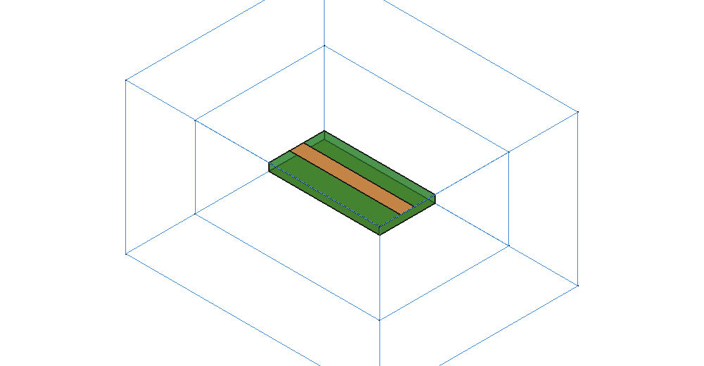
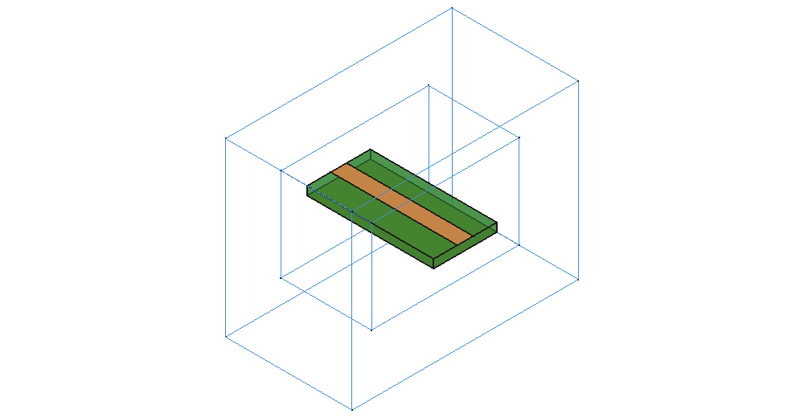
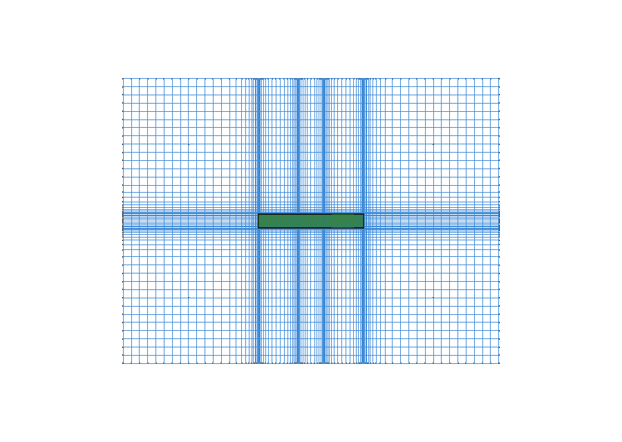

# Meshing

Mesh generation is described by these objects in the study:
1. **Mesh policy (solver-neutral)**: what the device asks of any mesh - a count
   across a feature, a distance a curved surface may be solved from, a floor
   against a sliver, and what lies beyond the structure on each face of the
   domain.
2. **Yee Grid**: what the openEMS adapter does about it, as the orthogonal
   finite-difference grid it lays.
3. **Gmsh Mesh**: what the tetrahedral mesher Palace reads does about it.

Where the two recipes ask for the same thing they spell it the same way,
because a user comparing the backends states the same numbers to both. One
number of elements per wavelength is a different accuracy on each, which is why
each pipeline states its own.

The mesh policy uses the generic term *element*. The openEMS adapter
generates rectangular Yee *cells*. The Palace mesher lays tetrahedra.

## Mesh Policy

What the device asks of any mesh, in the unit it was stated in. Each backend
answers each property or states that it does not. [Gmsh Mesh
(Palace)](#gmsh-mesh-palace) says how each reaches the tetrahedral mesh.

<!-- defaults: EMMeshPolicy -->
| Property | Default | Description |
|---|---|---|
| `MinElementsAcross` | 9 | Minimum element count across dielectric thickness |
| `MinElementSize` | 0 | Minimum allowed element size in millimetres (0 = automatic) |
| `CurveTolerance` | 0 | Maximum allowed surface deviation on curved geometry in mm (0 = CAD default) |

### MinElementsAcross

Enforces a minimum cell count across the thickness of solid dielectric
substrates. OpenEMS uses volume-averaging for dielectrics, and thin substrates
require multiple grid planes to represent the internal vertical field
gradient accurately.

Conductors are excluded from this rule; thin conductor foils are modeled as
zero-thickness `ConductingSheet` elements, or spanned by a single cell with
both faces pinned to grid planes.

On Palace it is not laid. The run states, for each region, the size of its
elements and the smallest side of the box round it.

### MinElementSize

Defines an absolute minimum cell size floor (in millimetres) to prevent
unintentional geometry slivers (e.g. from boolean operations) from forcing
extremely small timesteps in FDTD simulations.

On Palace it is a floor under every element size. 0 derives it: a hundredth
of the element size in the slowest material.

Keep `MinElementSize` at 0 unless diagnosing mesh issues.

### CurveTolerance

Controls surface triangulation resolution when exporting curved CAD bodies to
openEMS polyhedral representations.

- `0` (default): Uses the CAD kernel's standard triangulation deflection.
- Setting a positive value (in mm) enforces maximum chordal deviation between
  triangulated facets and true CAD curved surfaces.

On openEMS the translation report logs the mean surface deviation of each
curved body during Check and Run.

On Palace a `CurveTolerance` other than 0 is refused. The mesh carries the
curved surface in its elements.

### Simulation domain boundaries

Each domain face says what lies beyond the structure there, which is what
decides the boundary condition at the outer edge of the simulation volume:

<!-- defaults: EMMeshPolicy -->
| Property | Default | Description |
|---|---|---|
| `Padding<axis><side>` | Air | What lies beyond the structure (`Air`, `Through` or `Ends`) |
| `Clearance` | 0 | How far the medium reaches past the structure on each `Air` face, in millimetres (0 = derived from the band) |
| `Medium` | empty | The material filling every space no bound body fills, out through the absorber (empty = vacuum) |

- **`Air`**: The medium runs on beyond the structure. On openEMS the absorber
  sits outside a layer of it `Clearance` deep. On Palace the medium is reserved
  `Clearance` deep, and its outer side carries a first-order absorbing
  condition. Use for radiating structures and antennas.
- **`Through`**: On openEMS the structure runs out through the absorber. This
  terminates transmission lines directly into the absorbing boundary without
  reflecting ends, effectively modeling an infinitely long transmission line.
  On Palace `Through` is refused on every face no port's own plane bounds: see
  below.
- **`Ends`**: The domain stops where the structure does, and the face is a
  perfect wall. Use it on a face walled by a conductor, where nothing is
  measured outside the wall. On Palace a body that an `Ends` or a `Through`
  side touches only where the body curves away from it is refused: see
  [Running](running.md).

On openEMS the condition on each face follows from its `Padding` and from
nothing else:

| `Padding` | `Absorber` PML | `Absorber` Mur |
|---|---|---|
| `Air` | `PMLCells` of absorber beyond the air | Mur's condition on the face, beyond the air |
| `Through` | `PMLCells` of absorber over the structure's own outer cells | Mur's condition on the face, on the structure |
| `Ends` | a perfect electric wall on the drawn face | the same |
| `Ends`, with waveguide ports standing across the whole face | `PMLCells` of absorber beyond the ports' plane | refused |

A wall stands on the drawn face whatever the opposite face of its axis does: no
cell is laid beyond it. A waveguide port stands on a face where its plane lies
within a nanometre of it, and the cross-sections of several ports on one face
count together. The translation refuses, by name:

- An `Ends` face that waveguide ports cover only in part. openEMS states one
  condition for a whole face, so the rest of the face would absorb where the
  policy says it is a wall, or a wall would stand behind the port. A guide drawn
  with metal walls reaches this, since the walls take part of the end face. Draw
  the guide as the air inside it, so the `Ends` faces are its walls, or stand
  the port on a plane inside the guide and set the face to `Through`. The
  message states the area left uncovered.
- A waveguide port standing inside the guide with an `Ends` face behind it. The
  guide behind the port is then a stub shorted at the wall. openEMS would solve
  the stub, and Palace, which ends the model on the port's plane, cuts it away,
  so the two backends would solve different devices. Set that face to
  `Through`, or stand the port on the end face.
- Mur on an `Ends` face waveguide ports cover. The ports' sources lie on the
  face, and openEMS holds a Mur face shut while a source on it runs, which here
  is the whole run. Set `Absorber` to PML.
- A port whose plane lies in an `Ends` face, other than waveguide ports
  standing across the whole face: a lumped port lying flat in it, or a
  microstrip or coaxial port whose feed stands on it. The wall is a perfect
  conductor across the port, which shorts it. For a lumped port, set the face to
  `Air` or draw the port inside the structure. For a microstrip or coaxial port,
  set the face to `Through` so the line runs out through the absorber, set it to
  `Air`, or raise `FeedOffset` so the feed stands inside the structure.
- A lumped port lying in a `Through` face. The line the port drives runs on into
  the absorber rather than ending on the port. Set the face to `Air`, or draw the
  port inside the structure.
- Room a dielectric body stands against that is thinner than 0.001 of the
  least extent of the bodies round it, such as two bodies drawn to meet that
  miss each other, where no body of the medium's own material closes it. Both
  backends would lay cells or elements that thin across it, and both refuse it
  by name. Where such a body does close it, both solve the body grown over the
  gap and say so (see [Open studies](running.md#open-studies)).

How a face absorbs is the solver's own: see
[Absorber](running.md#absorber).

Palace builds no absorbing layer. On Palace, `Air` reserves the medium
`Clearance` deep beyond the face and puts a first-order absorbing condition on its
outer side: see [Open studies](running.md#open-studies).

`Through` is refused on every face no port's own plane bounds, because where such
a model ends the boundary carries a perfect wall and the wave the face was meant
to carry away is reflected whole. Which planes bound a face differs between the
two kinds of study, and the refusal says which:

- In either, a waveguide port standing across the face bounds it. The mesher
  leaves out what is behind the plane, so the model ends on the port and the
  port's own condition is what a wave meets there.
- In an **open** study a lumped port's plane also bounds the side of the reserved
  air it lies in. That plane is the whole side, the air beside the faces drawn
  there included, and outside the port's elements it is a magnetic wall.
- In a **closed** study there is no such side, so a lumped port bounds nothing.
  `Through` there wants a waveguide port across the face, or `Air`, which
  reserves the space that gives a lumped port's plane a side to lie in.





On openEMS, for `Through` faces, the outermost `PMLCells` of the model volume are
assigned to the absorbing boundary layer. Transmission lines extending
through these boundaries must remain uniform across the absorber depth.

### Clearance

How far the open surface stands from the structure on every face whose
`Padding` is `Air`. It is a length, and the domain grows by exactly that length
whatever the grid's density. A face saying `Through` or `Ends` reads none of it.

`0` derives it: 0.4 of the wavelength in the medium at `FrequencyStop`. That puts
the open surface the same share of a wavelength away at the top of every band,
so what it reflects of a radiated wave there is the same whatever the band.
It suits a circuit board, whose field is bound to the substrate. A radiator
wants more: at the bottom of its band the derived clearance is a smaller share
of the wavelength, and the absorber then stands in the near field. Type a
length for a radiator.

A face with no room in it is `Ends`, not a `Clearance` of 0.

### Medium

`Medium` links the material that fills every space no bound body fills: the room
round the structure, the inside of a hollow part, a pocket, a guide drawn as its
walls, and the absorber beyond each `Air` face. Leave it empty for vacuum. Link a
`Dielectric` from the document, lossless or lossy, magnetic or not: a board
potted in resin, an antenna in water, a sensor buried in soil. A body drawn and
bound stands over the medium, so a capsule of air inside tissue is a box of air
bound to a vacuum material.

The medium is one material for the whole study. A `PEC`, a `ConductingSheet` and a
`FrequencyDependentDielectric` are refused by name, and so is a link to an object
that is not a material.

On openEMS the absorber beyond a face the domain ends on, which waveguide ports
cover, carries on the guide behind the ports' plane and stays vacuum.

Each backend meshes the medium at its own wavelength, and a `Clearance` of `0`
is derived from that wavelength. Before the run the log names the medium, its
values at the band and its wavelength at `FrequencyStop`.

Neither absorber carries a medium's loss. openEMS' perfectly matched layer and
Palace's absorbing condition are each matched to the medium's impedance without
its loss, so they reflect part of a wave that reaches them. Where the medium is
lossy the log states that share and how much of it comes back across the
clearance, at whichever end of the band returns more. A lossy medium also
absorbs what crosses it, so a larger clearance lowers both.

openEMS takes a cell conducting above 1000 S/m for metal and lays no absorbing
layer there. A medium that conductive is refused where any face carries the
perfectly matched layer. Set the solver's `Absorber` to `Mur`, or link a medium
that conducts less.

On Palace a `Clearance` typed on a study with no `Air` face lays nothing. The run
states that with the length it was given.

## Yee Grid (openEMS)

What the openEMS adapter lays the policy's demands as.

<!-- defaults: EMYeeGrid -->
| Property | Default | Description |
|---|---|---|
| `ElementsPerWavelength` | 20 | Target cells per wavelength in the slowest medium in the model (highest `epsilon_r * mu_r`) at `FrequencyStop` |
| `EdgeRefinement` | 6 | Refinement factor for cells adjacent to conductor edges |
| `MaxGrowthRatio` | 1.3 | Largest size ratio between adjacent cells of the grid |

Element sizing is defined relative to electrical wavelength rather than fixed
millimetre dimensions, automatically adapting resolution when frequency or
substrate permittivity changes:

```
lambda_min          = wavelength(slowest_dielectric, FrequencyStop)
bulk_cell_size      = lambda_min / ElementsPerWavelength
conductor_cell_size = bulk_cell_size / EdgeRefinement
```

### EdgeRefinement

Conductor edge refinement is critical for planar transmission lines because
electromagnetic fields exhibit singular behavior at sharp metallic edges.
Under-resolving conductor edges alters extracted characteristic impedance.

- Setting `EdgeRefinement` to 1 sets target conductor edge cells to the bulk
  element size. Narrow conductors may still be refined further to maintain
  the minimum conducting width.
- Values less than 1 are rejected during validation.
- Refined grid lines are placed along conductor edges to resolve fringing
  fields.

For curved conductors, grid resolution scales with surface radius of
curvature. `EdgeRefinement` sets the lower bound on cell size for this
refinement. In addition, curved conductor boundaries are expanded outward by
0.5 Yee cells to compensate for discretization offset (see [Drawing the
device](geometry.md#where-a-curved-conductor-ends-up)).

## Mesh Refinement regions

Refinement regions define localized cell sizing for critical geometric
features (such as coupling gaps, tight inter-trace spacing, or resonant
notches).

Click **Add Mesh Refinement** to create a region targeting selected geometry.

<!-- defaults: EMMeshRegion -->
| Property | Default | Description |
|---|---|---|
| `References` | selection | Target geometric bodies or faces |
| `Mode` | Refine | Refinement direction (`Refine` to decrease cell size, `Coarsen` to increase) |
| `ElementSize` | 0 | Target element size in millimetres |
| `MinElementsAcross` | 0 | Minimum elements across region extent (0 = inherit global) |
| `Enabled` | true | Toggles region active status |

- `Refine`: Asks for elements no larger than `ElementSize` at the selected
  geometry. The openEMS grid refines every line across the bounding box of
  each selected shape. The Palace mesh sizes the shape itself and grows away
  from it.
- `Coarsen`: Allows non-critical bodies (such as mechanical brackets or
  housings) to use coarser cells up to the global bulk limit on the openEMS
  grid. The Palace mesh coarsens only the edges of metal whose binding the
  coarsening names whole; see [Gmsh Mesh (Palace)](#gmsh-mesh-palace).
  Both refuse a coarsening naming geometry no material binding names, since
  nothing there has a size of its own to settle for.

---

## How the grid is laid (openEMS)

The openEMS adapter constructs a non-uniform rectilinear Yee grid along each
Cartesian axis independently:



### 1. Fixed positions (Anchors)

Critical geometric planes are pinned to exact grid coordinates:
- Zero-thickness planar sheets (`ConductingSheet`).
- Solid conductor faces where no edge treatment applies: metal continuous
  through the plane, metal on both sides of it, or a face at a domain
  boundary. An isolated conductor edge instead receives a pair of lines
  straddling it, with none on the face.
- Domain boundaries.

Dielectric boundaries are treated as preferences; openEMS volume-averages cut
cells across dielectric interfaces.

### 2. Sizing field and placement

The mesher generates a continuous 1D sizing field along each axis, bounding
cell size transitions to `MaxGrowthRatio`. Grid lines are positioned by
integrating along the sizing field, ensuring smooth gradation.

### 3. Symmetry enforcement

The mesher evaluates whether pinned geometric anchors and the 1D sizing
field mirror symmetrically about the domain center along each Cartesian
axis. When geometric symmetry is present, the mesher automatically folds the
grid onto its mirror image to prevent numerical mode asymmetry. This check is
computed directly from the geometry and sizing field, independent of the
analysis symmetry property.

### 4. Memory budget guards

To prevent memory exhaustion, the mesher estimates the RAM required for
openEMS field arrays prior to building. Grids exceeding line or memory
thresholds are rejected during validation.

---

## Gmsh Mesh (Palace)

What the tetrahedral mesher lays the policy's demands as.

<!-- defaults: EMGmshMesh -->
| Property | Default | Description |
|---|---|---|
| `ElementsPerWavelength` | 20 | Target elements per wavelength in the slowest medium in the model at `FrequencyStop` |
| `EdgeRefinement` | 8 | How many times finer than bulk the elements are at an edge of metal the field is singular along |
| `ElementsPerTurn` | 6 | Elements round a full turn of a curved surface, where that is finer than the wavelength asks (0 = size by the wavelength alone) |
| `MaxGrowthRatio` | 1.6 | How much the element size grows per element away from a refined place. Adjacent tetrahedra also differ by their shape, so the ratio between two of them is not this number |

These two are a pair rather than two knobs, and they are not the Yee grid's. A
rim is asked for at the size everywhere over `EdgeRefinement`, and grows back to
the size everywhere over a ramp as wide as that difference divided by
`MaxGrowthRatio` less one. That ramp is the volume the refinement is paid for.
What the refinement buys is the element standing on the rim, which the growth
coarsens whatever the size along the rim, so a steeper growth with a finer ask
resolves the rim as well over a narrower ramp. Raise `EdgeRefinement` to spend
more at a rim, and lower `MaxGrowthRatio` toward 1 only where the elements a
short way off the rim matter in their own right.

Palace is meshed by Gmsh into tetrahedra. An element size on tetrahedra is the
same along every axis, and a size asked for at a place makes the elements
there finer and never coarser. Each property reaches the mesh as follows:

| Property | On the tetrahedral mesh |
|---|---|
| `ElementsPerWavelength` | The element size everywhere in the model |
| `MinElementSize` | A floor under every element size. 0 derives it: a hundredth of the element size in the slowest material. A rim or a refinement region asking for a size below it is laid at the floor, and the run states it |
| `ElementsPerTurn` | The element size on each curved surface and curve of the drawing: a full turn at its sharpest curvature at that point holds this many elements, where that is finer than the size everywhere. On a surface the size is one length at each point, so a thin wire is meshed at its radius along its whole length. 0 lays nothing |
| `EdgeRefinement` | The element size along each edge of metal bound to `PEC` or `ConductingSheet` that the room turns round by more than half a turn, including an edge on the boundary of the model. 1 lays nothing. Values less than 1 are refused |
| `MaxGrowthRatio` | How fast a finer size at a rim or in a refinement region grows back to the size everywhere. Required above 1 where either is laid |
| `MinElementsAcross` | Not laid. A count across a thickness would fill the whole body at that size. The run states it for each region, with the size of the region's elements and the smallest side of the box round it |
| `CurveTolerance` | Refused. The mesh carries the curved surface in its elements |
| `Padding` | `Air` reserves the medium `Clearance` deep beyond the face, meshed at the size in the medium, with a first-order absorbing condition on its outer side. `Through` is refused on any face no port's own plane bounds, since the boundary there carries a perfect wall. `Ends` walls the whole side of the reserved air, which is wider than the drawing wherever another face is `Air`, and the run states that side's area |
| `Clearance` | How far the open surface stands from the structure on each `Air` face. In a study with no `Air` face it lays nothing, and the run states it |

A second-order element follows a curved surface only across a limited arc, and
one laid across a tighter curve is turned inside out. `ElementsPerTurn` sizes
each curved surface by its radius for that reason: a wire, a pin, a via, a
fillet or a ring thinner than the size everywhere is meshed at a share of its
own radius. The floor stops the size where the curvature grows without bound,
at the apex of a cone and along a knife edge. A thin round body costs its
elements along its whole length, and the run reports the shortest element
edge of each labelled part. Where that cost is not wanted, draw the body
square, or set `ElementsPerTurn` to 0.

Where Gmsh cannot lay elements over part of the drawing, the run stops with
what Gmsh said. It names each label holding elements turned inside out and each
region left empty, with where they are, and where Gmsh says which surface it
stopped on, the labels on either side of it. A part that curves or narrows tighter than the elements laid
there is filled by finer ones: raise `ElementsPerTurn`, set `MinElementSize`
below the floor, or lay a `Mesh Refinement` on the part with an `ElementSize`
near its smallest radius or width. Where Gmsh cannot cut the
drawn shapes against each other, the run names the labels whose shapes were
being cut, and the element size changes nothing.

A `Mesh Refinement` set to `Refine` lays its `ElementSize` at each thing it
references: along a face, an edge or a vertex, and throughout a body, growing
back at `MaxGrowthRatio` away from it. The shape is cut into the mesh and
claims nothing of it, so the space a curved shape goes round, such as the inside
of a ring, is meshed at the size everywhere. A face the shape crosses is cut
into pieces and stays what it was: a waveguide port whose face a region crosses
keeps the line its voltage is read along. A vertex or an edge standing inside a
body is not something the body is meshed round: the elements there follow the
size asked, and have no corner on it. `ElementSize` at or above the size
everywhere lays nothing and is stated. `MinElementsAcross` on a region is not
laid and is stated.

A `Mesh Refinement` set to `Coarsen` is laid at the edges of metal bound to
`PEC` or `ConductingSheet` where the coarsenings name every face the binding
names. Bindings of `PEC` bodies that meet are one metal (see
[Overlaps](geometry.md#overlaps)), and it is coarsened only where the
coarsenings name every face each of those bindings names. The edges are refined to the coarser of `ElementSize` and
the size `EdgeRefinement` asks for, and not at all where that is at or above
the size everywhere. The run states the length of the metal's edges and how
near they come to another conductor, since a gap there is meshed as the edges
are; openEMS keeps such a gap at its own size. A coarsening naming some of
those faces, or geometry a dielectric is bound to, is not laid and is stated. One naming geometry no
binding names is refused, as it is for openEMS.

`EdgeRefinement` refines an edge where the field is singular: where the room
the model holds turns round the edge by more than half a turn. At the edge of a
perfectly conducting wedge the room opens round by an angle, the field goes as
the distance from the edge to the power of half a turn over that angle, less
one, which grows without bound past half a turn. So the free edge of a sheet, a
step, the edge of an iris and the outside of a fold are refined, and a guide's
inner corners, a flat seam, an edge where two faces meet tangentially and metal
meeting metal are not. The same holds for a sheet and for a body bound to a
conductor, so a guide drawn as a housing of metal is meshed as the guide drawn
as its air. The rest of the boundary is the sides of a box, which the room
stands inside, so none of its creases is refined. Room nobody bound is the
study's medium, so an iris is drawn as metal: a notch cut out of a body of air
is filled with the medium like the rest of the box.

What ends the room round an edge is metal, on each side it has room, and the
boundary of the model. A dielectric's face and the plane a port lies in inside
the model do not end it. Where the room ends on a magnetic wall, such as the
plane of a lumped port outside its elements, the room past the wall is its
reflection and is counted with it. An edge is refined where the room opens round
it by more than a degree past half a turn, anywhere along it: an edge where two
curved faces meet at an angle that changes along it is refined whole where any
part of it is.

A rounded edge is not refined, however small its radius, since the room turns
round it by half a turn; a `Mesh Refinement` on it sizes it. A corner where
edges meet is refined only as far as the edges meeting at it are.

The run reports, before Palace starts, how many elements fill the model and
how many of them each region holds, the shortest and longest element edge of
each labelled part, and for each rim and each thing a refinement names the size
asked for, the figure the mesh answers it with, and the median longest edge of
the elements touching it with their share of the model. For each rim it also
states how many edges of the metal the room turns round by no more than half a
turn, which carry nothing. The figure is the
longest element edge along a rim or on a refined face, the longest edge of the
elements at a refined vertex or at an edge inside a body, and the median mean
edge of the elements in a refined body. The share counts the layer of elements
on the place, and not the growth round it: what a rim costs is the difference a
`Coarsen` region on its binding at the size everywhere makes to the count.

The elements touching a refined place are coarser than those along it, and
coarser the steeper `MaxGrowthRatio`: a tetrahedron is sized from the edges of
the surface it stands on, and grows away from the place as the growth allows. A
steep growth leaves even the place itself coarser than asked, and the figure
beside the size asked shows it. Read that figure rather than assuming the size
was laid.

---

## Inspecting the mesh

On openEMS, click **Update Mesh** (on the toolbar or in the openEMS panel) to
generate the grid and display the visual preview in the 3D viewport. **Update
Mesh** lays the openEMS grid only, and refuses a study that holds no openEMS
solver.

On Palace, press **Mesh** in the Palace panel. The mesh goes into the study as
`Mesh (Palace)`, FreeCAD's own FEM mesh object. Its groups carry the labels of
the bindings and ports (see [Running](running.md#palace-task-panel)). What the
run reports about the mesh is described under [Gmsh Mesh
(Palace)](#gmsh-mesh-palace).

### Preview display modes (openEMS)

| `Display` mode | Description |
|---|---|
| `Outline` | Displays domain and PML absorber bounding boxes |
| `Slices` | Displays 3 orthogonal planar mesh cuts showing cell grading |
| `Anchors` | Displays pinned geometric boundary planes |

### Mesh report (openEMS)

The Update Mesh summary in the report view provides:
- Total Yee cell count and line count per axis ($N_x \times N_y \times N_z$).
- Smallest and largest cell dimensions across the model, with axis.
- Worst-case cell growth ratio.
- Element counts across each defined body.
- PML absorber depth.

### Checking convergence

To verify mesh convergence:
1. Run a baseline simulation and record S-parameters.
2. Increase `ElementsPerWavelength` (e.g. from 20 to 30) or `EdgeRefinement`
   (e.g. from 6 to 10).
3. Re-run the simulation. If S-parameters remain within acceptable tolerance,
   the mesh is converged.

On Palace, raise `ElementsPerWavelength` or `EdgeRefinement` on the Gmsh Mesh,
or `Order` on the Palace solver.

### Conductor width preservation (openEMS)

Point-sampling on a rectilinear Yee grid snaps conductor edges to the nearest
Yee cell edge. For narrow microstrip traces, this discretization can reduce the
effective conducting strip width by up to $2/3$ of a grid cell.

The mesher automatically calculates the required face cell size so that at
least 95% ($19/20$) of the drawn conductor width remains electrically
conducting. This sizing is derived algebraically from conductor dimensions,
maintaining consistent transmission line characteristic impedance.

Pre-flight checks evaluate the generated grid and emit a warning if any
conductor falls below this 95% threshold. Conductors explicitly coarsened by an
`EMMeshRegion` are exempt from this warning.

