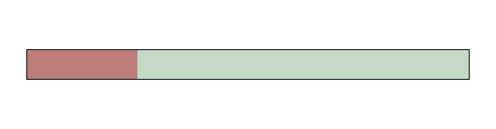

# Ports

A port defines excitation sources and measurement reference planes for the
simulation. In the 3D viewport, each port is represented by a bounding box
containing the source plane and voltage/current probe planes.

The displayed 3D bounding box reflects the exact volume and probe placement
passed to the solver. Verify port orientation and dimensions in the viewport
before running the simulation.

## Port types

| Type | Application | Characteristic Impedance |
|---|---|---|
| **Microstrip** | Planar trace over ground plane, fed across substrate | Extracted dynamically from simulated field |
| **Lumped** | Discrete circuit element, load, or feed across a gap | User-declared resistance value |
| **Rectangular waveguide** | Modal excitation in hollow rectangular guide | Calculated analytically from guide geometry and mode |

Reference impedance behavior:
- Microstrip ports extract impedance from field distributions at the
  measurement plane.
- Lumped ports enforce the declared resistance across the gap.
- Waveguide ports use analytic modal wave impedance.

## Creating a port

1. In the 3D viewport, select the required geometric faces or edges in the
   order specified in the table below (hold `Ctrl` for multiple selections).
2. Click **Add Microstrip Port**, **Add Lumped Port**, or **Add Waveguide
   Port**.

The command infers propagation and excitation axes directly from the selected
geometry. The wave enters through the selected trace cross-section and travels
along the normal; the excitation field vector points toward the reference
ground.

Selection order defines polarity:

| Port type | First selection | Second selection |
|---|---|---|
| **Microstrip** | Signal trace cross-section | Ground plane reference face or solid |
| **Lumped** | Source terminal face or edge | Reference terminal face or edge across the gap |
| **Waveguide** | Waveguide cross-section face | - |

Cross-section selections accept solid faces (`Part::Box`) or 1D edges on
zero-thickness planar sheets (`Part::Plane`).

For lumped ports, the element spans the transverse spatial overlap between
the two selected picks across the excitation gap (not their geometric union).

Avoid selecting the dielectric substrate. Port selections must be assigned to
conductors (`PEC` or `ConductingSheet`).

### Creation workflow

1. Create geometry (trace, substrate, ground plane).
2. Assign materials (`EMMaterialBinding`) to all conductors and dielectrics.
3. Create the `EMAnalysis` container and specify the frequency range.
   Microstrip ports calculate initial `MeasurementDistance` defaults from
   the analysis band.
4. Select geometric features in order and click the port command.
5. Inspect the generated port bounding box in the 3D viewport.

## Common port properties

<!-- defaults: EMPortMicrostrip, EMPortLumped, EMPortRectWaveguide -->
| Property | Default | Description |
|---|---|---|
| `Number` | assigned | Matrix index (row/column) in the S-parameter matrix |
| `Excitation` | true | Enables signal excitation. Each excited port requires one FDTD solve |
| `ReferencedTo` | Fixed impedance | Reference impedance definition for S-parameter normalization |
| `ReferenceImpedance` | 50.0 | Normalization impedance in ohms when `ReferencedTo` is Fixed impedance |

`Number` is assigned sequentially at creation to the lowest unused index in
the document. Existing ports are never renumbered.

`Excitation` determines whether the port acts as a driven source. An $N$-port
network with $N$ excited ports requires $N$ independent FDTD simulation
runs. Set `Excitation` to `false` for ports that only record received transmission
signals.

When a lumped port is excited, all microstrip ports in the study should also be
excited. In such a run the microstrip port reports a non-finite reference
impedance at every frequency point, and the matrix is normalized in each port's
reference impedance, so the run yields no S-parameters after taking its full
time. Pre-flight validation warns when an excited lumped port is combined with
an unexcited microstrip port.

### Reference impedance normalization

- **Fixed impedance** (default): S-parameters are renormalized to the
  specified value (typically 50 Ω).
- **Port impedance**: S-parameters are reported relative to the port's
  intrinsic characteristic impedance (field-extracted for microstrip,
  declared resistance for lumped, analytic modal impedance for waveguide).

`ReferenceImpedance` is hidden when `ReferencedTo` is set to Port
impedance.

---

## Microstrip port

Excites and measures quasi-TEM modes on planar transmission lines over a
ground plane.

**Selection:** Signal trace cross-section face/edge, then reference ground
plane face/solid.

### Propagation and excitation axes

<!-- defaults: EMPortMicrostrip -->
| Property | Default | Description |
|---|---|---|
| `PropagationAxis` | X | Direction of wave propagation into the structure |
| `ExcitationAxis` | -Z | Vector direction of electric field (trace to ground) |

Axes are inferred from selected geometry. If pre-flight validation detects
an orientation mismatch (such as an excitation vector pointing away from
ground), the error is reported before simulation.

### Port bounding box configuration

The port bounding box encloses the source excitation plane and the downstream
voltage/current probe planes.

Distances are specified in millimetres:

<!-- defaults: EMPortMicrostrip -->
| Property | Default | Reference origin | Description |
|---|---|---|---|
| `FeedOffset` | 0 | Source face | Distance from source face to excitation plane |
| `MeasurementDistance` | from the band | Excitation plane | Distance from excitation plane to probe measurement plane |
| `Length` | 0 | Source face | Total port box length (0 sets length to measurement plane) |
| `FeedResistance` | 0 | - | Series source damping resistance in ohms (0 = ideal source) |

`FeedOffset` is normally 0 mm when the trace terminates at the port boundary.
When transmission lines extend through absorbing boundaries (`Through`
padding), set `FeedOffset` so that the excitation plane is placed inside the
active domain beyond the absorbing boundary layer. The absorber thickness in
millimetres is determined during grid generation; running **Check** validates
the excitation and measurement planes, and reports the absorber depth together
with how far the plane falls inside it.

### Placement guidelines and MeasurementDistance

The voltage and current probes must be placed on a uniform line section,
sufficiently far from source near-field evanescent modes and downstream
discontinuities (such as stubs, steps, or bends).

The default `MeasurementDistance` is initialized to 10% of the free-space
wavelength at the lowest frequency ($\lambda_0 / 10$ at `FrequencyStart`),
rounded up to the nearest millimetre.

Evanescent feed modes attenuate exponentially over a distance proportional to
the line cross-section dimensions. If `MeasurementDistance` is reduced
manually, verify that probe planes remain outside the near-field region by
confirming that extracted line impedance remains stable.

Ensure the mesh around the measurement plane uses uniform cell sizing. Cell
size steps at probe locations can introduce numerical reflection errors.

### Impedance extraction

OpenEMS extracts characteristic transmission line impedance using three
voltage probes and two current probes centered on the measurement plane.

---

## Lumped port

Represents a discrete lumped circuit element, termination load, or voltage
feed spanning a gap between two conductors.

**Selection:** Source terminal face/edge, then reference ground face/edge.

<!-- defaults: EMPortLumped -->
| Property | Default | Description |
|---|---|---|
| `Resistance` | 50.0 | Port resistance in ohms (0 = short circuit / metal bridge) |
| `ExcitationAxis` | inferred | Axis along which electric field spans the gap |

`Resistance` defines the resistance of the internal sheet element. Setting
`Resistance` to 0 models a zero-resistance short circuit.

Selected faces must directly bound the gap along the excitation axis.
Selecting entire 3D solid bodies is rejected to prevent resistive sheets
from penetrating conductor volumes.

### Bounding box and grid alignment

The lumped port box spans the spatial overlap between the two selected
terminals along the excitation axis.

Both terminal ends of the gap must snap to distinct grid planes along the
excitation axis. A gap of one cell or wider always satisfies this. Pre-flight
validation rejects configurations where both terminals snap to the same grid
plane, which would cause openEMS to drop the lumped element.

### Line termination applications

Lumped ports are commonly used to terminate transmission lines with a matched
load (e.g. 50 Ω):
- For zero-thickness planar traces (`ConductingSheet`): Select the end edge
  of the trace, then the ground plane below.
- For 3D volumetric traces (`Part::Box`): Select the bottom edge of the end
  face where the conductor meets the substrate, then the ground plane.

---

## Rectangular waveguide port

Excites modal fields across the cross-section of a hollow rectangular
waveguide.

**Selection:** Waveguide interior cross-section face.

<!-- defaults: EMPortRectWaveguide -->
| Property | Default | Description |
|---|---|---|
| `Mode` | TE10 | Propagating modal field pattern |
| `Length` | 0 | Distance along propagation axis to probe plane (0 = 5 grid cells) |
| `PropagationAxis` | inferred | Direction of wave propagation into the guide |

Only TE modes are supported by openEMS waveguide ports. The mode index follows
standard microwave conventions (`TE10` represents the dominant mode along the
broad wall).

Validation requirements:
- The waveguide interior must be vacuum/air (dielectric-filled guides are
  not supported by openEMS waveguide ports).
- The selected mode must propagate within the simulation band. A mode cutting off
  above `FrequencyStop` is rejected during pre-flight checks. If the cutoff falls
  within the band, pre-flight emits a warning; below cutoff, modal propagation
  ceases and S-parameters represent evanescent attenuation.

## Reported problems

| Reported message | Cause | Corrective action |
|---|---|---|
| "there is no gap to drive across" | Selected terminals share the same coordinate on the excitation axis | Adjust selection or check geometry alignment |
| "the field points the other way" | `ExcitationAxis` opposes the physical vector to ground | Invert excitation axis sign |
| "stand apart along both X and Y" | Selected terminals are diagonal without axis alignment | Align terminals along coordinate axes |
| "the probes would sit on the source" | `MeasurementDistance` is $\le 0$ | Increase measurement distance |
| "the box would stop short of it" | Port `Length` is less than `FeedOffset + MeasurementDistance` | Increase port length or set to 0 |
| "does not say which side of it" | Selected face cuts through a solid without clear orientation | Select outer boundary face |
| No bounding box displayed in 3D | Missing geometry links, conflicting axes, or waveguide `Length = 0` | Set required links and check property editor |

