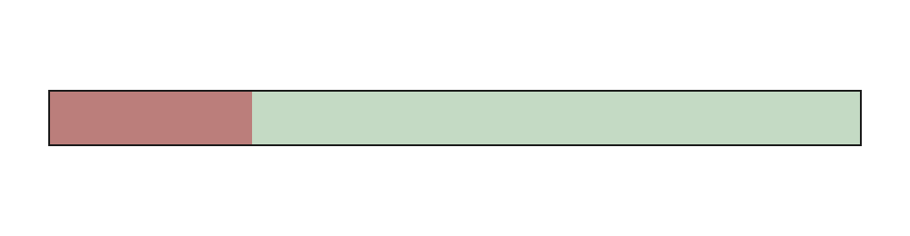

# Ports

A port defines excitation sources and measurement reference planes for the
simulation. In the 3D viewport, each port is represented by a bounding box
containing the source plane and voltage/current probe planes.

On openEMS the displayed 3D bounding box reflects the exact volume and probe
placement passed to the solver. On Palace a waveguide port is the face it
stands on, and a lumped port the rectangles laid between its picks. Palace
reads no probe planes. Verify port orientation and dimensions in the viewport
before running the simulation.

## Port types

| Type | Application | Characteristic Impedance | Backends |
|---|---|---|---|
| **Microstrip** | Planar trace over ground plane, fed across substrate | Extracted dynamically from simulated field | openEMS |
| **Lumped** | Discrete circuit element, load, or feed across a gap | User-declared resistance value | openEMS, Palace |
| **Rectangular waveguide** | Modal excitation in rectangular guide | The port's own mode | openEMS, Palace |

Reference impedance behavior:
- Microstrip ports extract impedance from field distributions at the
  measurement plane.
- Lumped ports enforce the declared resistance across the gap.
- Waveguide ports are referenced to their own mode. openEMS states the
  analytic modal wave impedance. Palace states the power-voltage impedance
  where the port's face is a plain rectangle in a lossless model, and none
  otherwise (see [Running](running.md#execution-model)).

## Creating a port

1. In the 3D viewport, select the required geometric faces or edges in the
   order specified in the table below (hold `Ctrl` for multiple selections).
2. Click **Add Microstrip Port**, **Add Lumped Port**, or **Add Waveguide
   Port**.

The command infers propagation and excitation axes directly from the selected
geometry. The wave enters through the selected trace cross-section and travels
along the normal; the excitation field vector points toward the reference
ground.

Selection order defines polarity:

| Port type | First selection | Second selection |
|---|---|---|
| **Microstrip** | Signal trace cross-section | Ground plane reference face or solid |
| **Lumped** | Source terminal face or edge | Reference terminal face or edge across the gap |
| **Waveguide** | Waveguide cross-section face | - |

Cross-section selections accept solid faces (`Part::Box`) or 1D edges on
zero-thickness planar sheets (`Part::Plane`).

For lumped ports, the element spans the transverse spatial overlap between
the two selected picks across the excitation gap (not their geometric union).

Avoid selecting the dielectric substrate. Port selections must be assigned to
conductors (`PEC` or `ConductingSheet`).

### Creation workflow

1. Create geometry (trace, substrate, ground plane).
2. Assign materials (`EMMaterialBinding`) to all conductors and dielectrics.
3. Create the `EMAnalysis` container and specify the frequency range.
   Microstrip ports calculate initial `MeasurementDistance` defaults from
   the analysis band.
4. Select geometric features in order and click the port command.
5. Inspect the generated port bounding box in the 3D viewport.

## Common port properties

<!-- defaults: EMPortMicrostrip, EMPortLumped -->
| Property | Default | Description |
|---|---|---|
| `Number` | assigned | Matrix index (row/column) in the S-parameter matrix |
| `Excitation` | true | Enables signal excitation. On openEMS each excited port requires one FDTD solve. Palace solves every excited port in one run |
| `ReferencedTo` | Fixed impedance | Reference impedance definition for S-parameter normalization |
| `ReferenceImpedance` | 50.0 | Normalization impedance in ohms when `ReferencedTo` is Fixed impedance |

A waveguide port is made with `ReferencedTo` set to Port impedance.

`Number` is assigned sequentially at creation to the lowest unused index in
the document. Existing ports are never renumbered.

`Excitation` determines whether the port acts as a driven source. On openEMS
an $N$-port network with $N$ excited ports requires $N$ independent FDTD
simulation runs. Palace solves every excited port in one run. Set `Excitation` to `false` for ports that only record received transmission
signals.

When a lumped port is excited, all microstrip ports in the study should also be
excited. In such a run the microstrip port reports a non-finite reference
impedance at every frequency point, and the matrix is normalized in each port's
reference impedance, so the run yields no S-parameters after taking its full
time. Pre-flight validation warns when an excited lumped port is combined with
an unexcited microstrip port.

### Reference impedance normalization

- **Fixed impedance** (the default on every kind but a waveguide port):
  S-parameters are renormalized to the specified value (typically 50 Ω).
- **Port impedance** (the default on a waveguide port): S-parameters are
  reported relative to the port's intrinsic characteristic impedance
  (field-extracted for microstrip, declared resistance for lumped, analytic
  modal impedance for waveguide). A guide is measured against its own mode, as
  a TRL calibration references it to the line standard, and Palace reports a
  wave port against nothing else. On Palace a `Fixed impedance` reference on a
  waveguide port is refused.

`ReferenceImpedance` is hidden when `ReferencedTo` is set to Port
impedance.

A fixed reference far from a port's own impedance can magnify whatever error
the solve left. Between real impedances the factor is at most the VSWR of the
reference against the port. A waveguide port is several hundred ohms, so a
guide with every port referenced to 50 Ω can carry up to about ten times the
solve's error. The log warns when the matrix as
reported can carry more than twice the solve's error, and names the ports whose
reference is that far out. At its own impedance a port carries the solve's
error unmagnified.

### A port that is not driven

On openEMS an undriven port is terminated by whatever lies behind its plane: a
lumped port by its own element, a microstrip or waveguide port by the line or
guide running on into the absorber. None of them takes up exactly what reaches
it, so the undriven port sends part of the wave back into the device. Where
every port is driven, or a declared mirror stands for the second run, the
workbench counts those waves out and the matrix is the device between the ports'
planes. Where a column is read alone, it is the device with the other ports
terminated as the run left them. The log warns when that can move a term of
the matrix as reported by more than the bar a response still ringing is held
to, and names the ports to drive. The figure is an absolute error in S: a
stopband transmission smaller than it can be off by more than its own size. It
is an upper bound, close for a lossless device and loose for a lossy one. A
wave an undriven port did not read is left out of it.

On Palace an undriven waveguide port absorbs its own mode, and an undriven
lumped port is its resistance.

---

## Microstrip port

Excites and measures quasi-TEM modes on planar transmission lines over a
ground plane. The microstrip port is openEMS only. Palace refuses it by name.

**Selection:** Signal trace cross-section face/edge, then reference ground
plane face/solid.

### Propagation and excitation axes

<!-- defaults: EMPortMicrostrip -->
| Property | Default | Description |
|---|---|---|
| `PropagationAxis` | X | Direction of wave propagation into the structure |
| `ExcitationAxis` | -Z | Vector direction of electric field (trace to ground) |

Axes are inferred from selected geometry. If pre-flight validation detects
an orientation mismatch (such as an excitation vector pointing away from
ground), the error is reported before simulation.

### Port bounding box configuration

The port bounding box encloses the source excitation plane and the downstream
voltage/current probe planes.

Distances are specified in millimetres:

<!-- defaults: EMPortMicrostrip -->
| Property | Default | Reference origin | Description |
|---|---|---|---|
| `FeedOffset` | 0 | Source face | Distance from source face to excitation plane |
| `MeasurementDistance` | from the band | Excitation plane | Distance from excitation plane to probe measurement plane |
| `Length` | 0 | Source face | Total port box length (0 sets length to measurement plane) |
| `FeedResistance` | 0 | - | Series source damping resistance in ohms (0 = ideal source) |

`FeedOffset` is normally 0 mm when the trace terminates at the port boundary.
When transmission lines extend through absorbing boundaries (`Through`
padding), set `FeedOffset` so that the excitation plane is placed inside the
active domain beyond the absorbing boundary layer. The absorber thickness in
millimetres is determined during grid generation; running **Check** validates
the excitation and measurement planes, and reports the absorber depth together
with how far the plane falls inside it.

### Placement guidelines and MeasurementDistance

The voltage and current probes must be placed on a uniform line section,
sufficiently far from source near-field evanescent modes and downstream
discontinuities (such as stubs, steps, or bends).

The default `MeasurementDistance` is initialized to 10% of the free-space
wavelength at the lowest frequency ($\lambda_0 / 10$ at `FrequencyStart`),
rounded up to the nearest millimetre.

Evanescent feed modes attenuate exponentially over a distance proportional to
the line cross-section dimensions. If `MeasurementDistance` is reduced
manually, verify that probe planes remain outside the near-field region by
confirming that extracted line impedance remains stable.

Ensure the mesh around the measurement plane uses uniform cell sizing. Cell
size steps at probe locations can introduce numerical reflection errors.

On openEMS, on an open board, the probes also read field that is not the
line's own wave: current on the board as a whole, and the surface and space
waves a discontinuity launches. Distance from a stub does not remove it. More
air does not remove it either. A matrix read through such ports departs
from reciprocity, and where every port is driven the log states the departure
past a bar.

### Impedance extraction

OpenEMS extracts characteristic transmission line impedance using three
voltage probes and two current probes centered on the measurement plane.

---

## Lumped port

Represents a discrete lumped circuit element, termination load, or voltage
feed spanning a gap between two conductors.

**Selection:** Source terminal face/edge, then reference ground face/edge.

<!-- defaults: EMPortLumped -->
| Property | Default | Description |
|---|---|---|
| `Resistance` | 50.0 | Port resistance in ohms (0 = short circuit / metal bridge) |
| `ExcitationAxis` | inferred | Axis along which electric field spans the gap |

`Resistance` defines the resistance of the internal sheet element. Setting
`Resistance` to 0 models a zero-resistance short circuit.

Selected faces must directly bound the gap along the excitation axis.
Selecting entire 3D solid bodies is rejected to prevent resistive sheets
from penetrating conductor volumes.

On openEMS, `SourceEntity` and `ReferenceEntity` each name one face or edge,
and a port naming more is refused. On Palace `ReferenceEntity` may name
several: see [Lumped ports on Palace](#lumped-ports-on-palace).

### Bounding box and grid alignment on openEMS

The lumped port box spans the spatial overlap between the two selected
terminals along the excitation axis.

Both terminal ends of the gap must snap to distinct grid planes along the
excitation axis. A gap of one cell or wider always satisfies this. Pre-flight
validation rejects configurations where both terminals snap to the same grid
plane, which would cause openEMS to drop the lumped element.

### Line termination applications

Lumped ports are commonly used to terminate transmission lines with a matched
load (e.g. 50 Ω):
- For zero-thickness planar traces (`ConductingSheet`): Select the end edge
  of the trace, then the ground plane below.
- For 3D volumetric traces (`Part::Box`): Select the bottom edge of the end
  face where the conductor meets the substrate, then the ground plane.

### Lumped ports on Palace

Palace lays a lumped port on one flat rectangle for each face or edge
`ReferenceEntity` names. Each rectangle spans the overlap between
`SourceEntity` and that reference across `ExcitationAxis`, and runs from the
source to the reference. The rectangles stand in parallel, so a strip between
two ground planes is one port: select the strip's end edge as `SourceEntity`,
and the ground face below and the ground face above as `ReferenceEntity`.
`ReferenceEntity` is one property naming faces of one object, so the two
grounds have to be faces of one body. Ground planes drawn as two separate
sheets cannot be the reference of one port.

A line between two conductors driven to only one of them launches a field the
line does not carry, and on a short line that field reaches the other port.
Nothing checks for it.

A rectangle is flat, so the source is an edge along an axis. A source face
across the gap and a source edge at an angle to the axes are refused.

Where a rectangle lies on the region's boundary, the whole of the boundary
face it lies in carries a magnetic wall, except where metal is drawn on that
face. The face is the region's face in the rectangle's plane, with the faces of
bodies that meet in that plane taken together. The wall would short the
rectangle along its sides. At the end of a line this changes only the end face.
A rectangle in a gap on the top face of a closed box turns the whole top face
into a magnetic wall: draw the metal of the lid as a sheet bound to `PEC` on
that face, and leave the gap bare. **Run** names each face that carries the
magnetic wall.

A rectangle that lies partly on the region's boundary and partly inside the
region is refused. A sheet of metal along a side of a rectangle, over the whole
side or part of it, is refused before the mesh is made, and so is a side on
the edge of the region, where the boundary beside it is the wall. The mesh is
asked again, and a rectangle that any metal label or the wall meets along a
side, or that meets metal at one end only, is refused before Palace runs.

Where both ends of a rectangle lie on the region's boundary, **Run** warns before
Palace runs, naming the port and the rectangle. The boundary is a perfect
conductor where no metal is drawn, so the rectangle is driven between two parts
of that boundary, and the warning names any metal drawn on the boundary at an
end. A trace drawn on the region's face over a ground on the opposite face is
that case. Whether the two parts are one conductor is not decided, and the run
goes on.

A rectangle inside the region, lying on no face of it, is taken. **Run** names
what stands nearest it on each side of its plane and how far away.

Where the study reserves air, the region's boundary is the box of reserved air
round the structure: see [Open studies](running.md#open-studies). A rectangle lies on the
boundary only where it lies in an `Ends` or `Through` side of that box.

On an `Ends` side the magnetic wall is the faces of the bodies drawn in that
side, and the rectangle has to lie on one of them. The air beside those faces is
the wall, so a rectangle whose side meets it is refused.

On a `Through` side the magnetic wall is the whole side, the air beside the drawn
faces included, and **Run** states that air's area. The field a line holds in the
air meets the side squarely, and a magnetic wall ends the line there as the
port's plane does.

An `Air` side of the box is not the wall, and **Run** names it as the open
surface where it stands nearest a rectangle. An open study is driven through
lumped ports only, and a waveguide port in one is refused.

`Resistance` 0 is refused on Palace: draw a short as a sheet bound to `PEC`.
The S-parameters are referenced to `Resistance`. A `Fixed impedance` reference
other than `Resistance` is refused. A study holding a lumped port and a
waveguide port is refused.

---

## Rectangular waveguide port

Excites modal fields across the cross-section of a hollow rectangular
waveguide.

**Selection:** Waveguide interior cross-section face.

<!-- defaults: EMPortRectWaveguide -->
| Property | Default | Description |
|---|---|---|
| `Mode` | TE10 | Propagating modal field pattern |
| `ReferenceDepth` | 0 | How far into the guide from the picked face the S-parameters are referred (0 = the face) |
| `PropagationAxis` | inferred | Direction of wave propagation into the guide |
| `ReferencedTo` | Port impedance | Reference impedance definition for S-parameter normalization |

The mode is launched on the picked face on both backends. The S-parameters are
referred to a plane `ReferenceDepth` into the guide from that face, and 0 is the
face itself. Palace de-embeds each port's answer to that plane with its `Offset`.
openEMS reads the wave five cells into the guide and the adapter moves what it
read to that plane. Both move the answer by the propagation constant of the
port's own mode, which is exact only where the guide over that distance is a
prism along its axis with walls of metal. The run sweeps the port's
cross-section that far into the model and refuses the port where either fails:

- A bound part or sheet holds of the sweep something other than its own section
  at the face carried the whole distance. A part or an iris standing in the
  guide does this however thin it is, down to what the CAD kernel can hold, and
  so does a wall that stops short, as the roof over a cavity does. A slab of
  dielectric or a fin of metal running the whole distance does not. A `PEC`
  sheet lying on a side that is already a wall is the same wall and changes
  nothing; a `ConductingSheet` there over part of the distance changes the
  wall's loss along the guide, and is refused.
- A side of the sweep is not a wall: it opens into a bound part, as a pocket or
  a widening does, or onto what the backend does not make a wall. A wall is
  what reflects: `PEC`, or a `ConductingSheet` letting through less than a
  thousandth of a wave meeting it, the rule Palace holds every conducting sheet
  to. On either backend a side with nothing bound beyond it is a wall only where
  it lies on a face of the domain `Padding` makes a wall, and anywhere else it
  opens onto the medium the study fills undrawn room with.

The run names the part and the depth. A port picking several faces is swept
across all of them as one cross-section. On openEMS the distance is the deeper
of the reference plane and the grid line it reads on, so a part standing within
that line of the face is refused there even at `ReferenceDepth` 0, while Palace
takes it; the message says how far the part has to move, and a finer mesh
brings the line closer.

On Palace, `PropagationAxis` also decides which side of the cross-section the
model is on. A port on a plane drawn across the guide leaves out what stands
behind it. The face has to be flat and square to that axis, and anything else is
refused before a process starts, naming how far the face spans along the axis.
Palace solves a port's modes as those of a guide running straight through the
face, which a curved face is not a cross-section of. A flat face at an angle to
the axes is a cross-section, but Palace can fail to fix the sign of its mode
there and return no answer.

On Palace, the port's mode is solved on its face alone, with the metal meeting
the face as the walls of that cross-section, and a wave port absorbs that one
mode and nothing else. The workbench refuses a port whose face does not carry
exactly one mode:

- Metal on the face that does not touch the rest of the metal there is a
  second conductor. A guide with two conductors carries a wave between them,
  and Palace takes that wave instead of TE10. Join the metal to the wall at the
  face, or end it short of the face. A hole in the body the field fills, where
  it meets the face, is a second conductor too, and so is a `PEC` sheet that
  touches the face at a single point. This is refused once the mesh exists.
- Before the band is solved, Palace is asked for the modes of each port's face
  at each end of the band. A face carrying more than one mode is refused: the
  port takes the first, and the power in the others is missing from the matrix.
  The message names the port, the wave numbers, and the metal that divides the
  face where a sheet runs across it. Two unequal fins, a strip joined to a side
  wall, a square guide, and a band that reaches the guide's next mode all do
  this. End the band below where the second mode propagates, or change the
  cross-section. A face carrying no mode is refused too, which a band starting
  below the guide's cutoff does at its bottom. In a very lossy filling the mode
  run can miss the guide's own mode, and the message then says so.
- A port whose mode loses power as it travels is refused where its face would
  reflect more than a four-thousandth of the power. Palace matches a wave port
  to the real part of its mode's wave number and drops the loss, so the face
  reflects part of the mode as though the model did, even in a uniform guide.
  Two faces reflecting in phase make four times one face's share, which is the
  figure held to the bar. For a TE mode the share follows from the wave number,
  and for a face crossing more than one material, whose mode is neither TE nor
  TM, the same figure is an estimate. In a guide filled throughout it is
  largest at the bottom of the band, and it grows near the guide's cutoff.
  Under the bar the log states it. A board material in a filled guide stays
  under the bar except near cutoff; an absorbing filling does not. Draw the
  port where the guide loses less, or start the band further above its cutoff.

Two ports whose faces meet along a curve that no metal holds are refused once
the mesh exists, naming both. Palace solves each port's mode with every other
port's face as a wall, and the field between the two has no wall there: a
guide's end split across its height into two ports leaves part of the power
missing from the matrix, and one split across its width leaves each half below
cutoff. Draw the metal the guide has along the curve, or stand the ports apart.

A face divided so that only one part carries a wave, or a fin off the floor
that makes a ridged guide, carries one mode, and the run is solved. The log
states each port's mode and how far the slowest-dying of the other modes Palace
found travels before it falls by a factor of e. That mode is not always the
slowest there is.

A port standing near a change in the guide is solved, and the run says what it
cost. A port's condition is matched to its own mode, so it takes up part of the
field that a change leaves at the face, and that power stands in no term of the
matrix. How far that field reaches grows as the top of the band nears the next
mode's cutoff, and a junction or a post well clear of the port then loses power
the matrix does not show. Palace also measures the power leaving through each
port's face, and after the band is solved the log states, for each driven port,
the largest share of its power the matrix leaves unaccounted for and the
frequency. Power the model turns into heat is not counted. Past a tenth of a
percent either way the line is a warning, which names the port whose face took
the most, and the matrix is stored either way, with the figure in its
provenance. Draw each port where the guide runs uniform, and keep the band
clear of the next cutoff.

On a model that dissipates, the heat is read from the same power measurement,
whose error is larger on a coarse mesh or at a low order. There the line can
warn of more power than went in, and a small share a port took can go unseen.
At the workbench's defaults, order 3 and twenty elements a wavelength, the
error is far smaller.

Only TE modes are supported by openEMS waveguide ports. The mode index follows
standard microwave conventions (`TE10` represents the dominant mode along the
broad wall). Palace takes `TE10` alone and refuses any other `Mode` by name.
Palace ranks a port's modes by wave number and names none of them, so which of
them is another `Mode` depends on the cross-section.

Validation requirements:
- On openEMS the waveguide interior must be vacuum/air (dielectric-filled
  guides are not supported by openEMS waveguide ports). Palace solves a filled
  guide, under the rule above for a mode that loses power. Where the study's `Medium` is not
  vacuum it fills a guide drawn as its walls, so draw the guide's inside as a
  box and bind a vacuum material to it.
- The selected mode must propagate across the whole simulation band. A band
  reaching below the mode's cutoff is refused on openEMS during pre-flight
  checks, naming the cutoff: below it the mode decays rather than travels, the
  port reads a reflection that means nothing, and moving it to the reference
  plane multiplies it by the decay. Start the band above the cutoff. Palace
  refuses such a band before the driven run, because the mode run at the bottom
  of the band finds no mode for its wave port to take there.

On openEMS a waveguide port standing near a change in the guide reads part of
the field the change leaves at its plane along with its mode. Nothing at the
port's plane takes that field up, and the reading carries part of it into the
matrix. Each waveguide port is therefore read again at two planes inside its
box: a line short of its source, and about halfway there. What each plane
recorded is carried to the port's plane along the guide as the grid carries the
mode, and the waves it predicts are set against the ones the port read. A guide
carrying the port's mode alone predicts them exactly.

The difference at the deeper plane bounds what the field can cost the matrix,
to first order and for a field that dies away along the guide. A plane inside
still holds part of the field, most where the next mode the port reads is near
its cutoff, so the difference is divided by the share of the field the plane
does not hold. A shallow box divides by a small share, which also magnifies
whatever the reading itself leaves at the plane. After the solve the log warns
where the bound passes a tenth of a percent of the wave driven in, naming the
port with the largest part of it and the frequency, and the figure is stored in
the result's provenance either way. The bound is loose, so it can warn of a
column off by several times less than that. It bounds the port's reading alone:
a field that also reaches the port's source or the absorber behind it, as it does
where the box is short and a change stands close in front, changes the device
itself, and the column can then be off by more than the figure. A second mode
the port reads that propagates in its guide does not die away, and the bound
does not cover it.

The two planes also tell a field in front of the port from one behind it. A
field dying away from the structure differs by less at the deeper plane,
against the depths, than a field growing toward the source, which a guide
changing behind the port, toward the absorber, leaves. Where the log says the
difference grows with depth faster than a field dying away could, it names the
causes on that side: a change behind the port, which leaves the matrix right;
the port's own source launching more than its mode, as it does where the box is
not drawn on the guide's walls, which does not; and a port whose mode is near its
cutoff. Where the two cannot be told apart, or the box holds one line
between its source and its plane and gives one plane, the log says so.

A run whose record was cut short is warned of for that, and not for this.
Frequencies where a port's mode does not propagate are left out of the figure,
and a run whose waveguide readings were left as openEMS returned them is not
weighed, which that run's own warning says. The log also names a port whose
box holds no grid line between its source and its plane, which is not read
again. Draw each port where the guide runs uniform for several cells toward the
structure.

On openEMS the run also weighs how much of the power driven in the waveguide
ports account for together: each port's net power, summed, over the power
driven in. It is weighed where every port in the run is a waveguide port read
at its own scales, where the ports facing any one absorbing face read on one
plane, and where the record's tail cannot move the sum by half the bar. The
figure furthest below zero and the one furthest above are stored in the
result's provenance, each at its own frequency, or the reason the run was not
weighed. The log warns where the ports give out more than a tenth of a percent
more power than went in, which no passive model does. It also warns where they
account for that much less, in a model that dissipates nothing and whose every
absorbing face is closed. A face is closed where every electric edge on the
plane the ports facing it read on is tied to metal, outside those ports'
guides; where no port faces it, the plane is the absorber's inner one, which
for Mur is one line in from the face. A face
whose plane holds untied edges is still closed where no field driven at the
ports can reach them, so a guide drawn as metal walls with air beyond them is
found closed, and a slot in a wall between the ports' planes opens it. Either
the ports read the waves wrong, and the column that run
measures is off by at least the amount the log states beside the figure, a
little under half of it, or, where they account for less, a mode besides a
port's own propagates in its guide and carries power into the absorber. A port in a mode other than its guide's lowest always has
the lowest beside it. The figure reads less where the error is out of phase
with the column, and where two ports' errors cancel.

## Reported problems

| Reported message | Cause | Corrective action |
|---|---|---|
| "there is no gap to drive across" | Selected terminals share the same coordinate on the excitation axis | Adjust selection or check geometry alignment |
| "the field points the other way" | `ExcitationAxis` opposes the physical vector to ground | Invert excitation axis sign |
| "stand apart along both X and Y" | Selected terminals are diagonal without axis alignment | Align terminals along coordinate axes |
| "the probes would sit on the source" | `MeasurementDistance` is $\le 0$ | Increase measurement distance |
| "the box would stop short of it" | Port `Length` is less than `FeedOffset + MeasurementDistance` | Increase port length or set to 0 |
| "does not say which side of it" | Selected face cuts through a solid without clear orientation | Select outer boundary face |
| "the axis the wave travels" | On Palace, the port's face is curved, or at an angle to `PropagationAxis` | Select the guide's end face, or cut the guide flat and square where the port stands |
| "meet along a curve no metal holds" | On Palace, two ports' faces touch, and each port's mode is solved with the other's face as a wall | Draw the metal the guide has along the curve, or stand the ports apart |
| "pieces that do not touch there" | On Palace, metal on the port's face stands apart from the wall | Join the metal to the wall at the face, or end it short of it |
| "modes at" | On Palace, the port's face carries more than one mode at an end of the band | End the band below the second mode, or change the cross-section |
| "carrying no mode" | On Palace, the port's face carries no mode at an end of the band | Start the band above the guide's cutoff. Where the model holds a lossy filling, draw the port in a lossless one |
| "as though the model did" | On Palace, the port's mode loses power as it travels, in a lossy filling or near cutoff between lossy walls, and the port reflects part of it | Draw the port where the guide loses less, or start the band further above its cutoff |
| "unaccounted for" | On Palace, a port took up field besides its own mode: a change in the guide stands near it, or the band's top nears the next cutoff | Draw the port farther from the change, or end the band further below the next cutoff |
| "unaccounted for" ... "a lumped port" | On Palace, the matrix of a study driven through lumped ports leaves part of the power unaccounted for, and most of it left through that port | The line states the share and no cause |
| "meets along a side" | On Palace, a sheet of metal, or the wall once the mesh exists, lies along a side of a lumped port's rectangle, which shorts it | Keep the metal off the rectangle's sides. Where it is the wall, draw the rectangle clear of the edge of the region |
| "runs along the edge of the region" | On Palace, a side of a lumped port's rectangle lies on the region's boundary outside its own plane, where the wall shorts it | Draw the rectangle clear of the edge of the region |
| "both of whose ends lie on the region's boundary" | On Palace, both ends of a lumped port's rectangle lie on the region's boundary, which is a perfect conductor where no metal is drawn | A warning, and the run goes on. Where the two parts of the boundary are not meant to be one conductor, draw the region on past the metal at one end |
| "past the side" | On Palace, part of a lumped port's rectangle stands outside the box the model lies in: round every shape bound to a material, grown by the clearance on each side open to free space, and ending where the drawing reaches on each side the study ends on. A conductor picked for the port is bound to nothing | Bind the conductor at each end of the element to a material, or pick conductors the study binds |
| "which is open to free space" | On Palace, a lumped port's rectangle lies in a side of the reserved air open to free space, which carries the absorbing condition | Bind the conductor at each end of the element to a material, or pick conductors the study binds |
| "meets metal at one end only" | On Palace, an end of a lumped port's rectangle meets no metal once the mesh exists | Select the conductor at each end of the gap |
| "is a microstrip port, and this solver is driven here through" | On Palace, the study holds a microstrip port | Drive the study through lumped or waveguide ports, or run it on openEMS |
| "This solver ranks a port's modes by wave number" | On Palace, a waveguide port's `Mode` is not `TE10` | Set `Mode` to `TE10` |
| "A wave port here is reported against its own mode" | On Palace, a waveguide port's `ReferencedTo` is `Fixed impedance` | Set `ReferencedTo` to Port impedance |
| "names 2 sub-elements" | On openEMS, a lumped port's `SourceEntity` or `ReferenceEntity` names more than one face or edge | Select one. A reference with several faces is taken on Palace |
| "more power than went in" | On Palace, the matrix and the heat the model dissipates account for more power than the driven port sent in, which the mesh causes | Refine the mesh |
| "more power than was driven in" | On openEMS, the waveguide ports give out more power than went in, which no passive model does: a port reads a field a change in the guide leaves near it | Draw the port farther from what changes the guide |
| "less power than was driven in" | On openEMS, in a model that dissipates nothing and loses power only through its ports, the ports account for less than went in: a port reads a field a change in the guide leaves near it, or a mode besides a port's own carries power into the absorber | Draw the port farther from what changes the guide, or end the band below where a second mode propagates in the ports' guides |
| "is not weighed for a field besides its mode" | On openEMS, a waveguide port's box holds no grid line between its source and its plane, or the plane inside it could not be read, for the reason given | Draw the box deeper, or where the guide runs uniform through it |
| "planes inside their boxes predict" | On openEMS, the waves a waveguide port read differ from those planes inside its box predict, by enough for the matrix to be off by something of the order stated: a change in the guide stands near the port. Where the log says the difference grows with depth faster than a field dying away could, the change may stand behind the port and the matrix be right, or the port's box is not drawn on the guide's walls, or the port's mode is near its cutoff | Draw the port farther from the change, and its box on the guide's walls |
| "left as openEMS returned it" | On openEMS, a waveguide port's reading could not be modelled, for the reason given, and every waveguide port in the run keeps the engine's own | Draw the guide empty and walled by solid metal at each port |
| "can be off S by up to about" | On openEMS, ports not driven in a run sent back part of the wave reaching them, and a column read alone carries it, changed by any renormalisation to the reference asked for | Drive the ports the message says to drive, or declare the mirror on a symmetric two-port |
| "magnify an error in the solve" | A port is reported against a fixed impedance far from its own, and renormalising there multiplies the error the solve left by up to the figure quoted | Set `ReferencedTo` to Port impedance on the ports named |
| "the device's two are equal" | Two terms that are equal for every device a model can hold are not, so at least one is off by half the figure or more. A record still ringing causes it, and so does a port reading more than its line's wave: on openEMS a microstrip port on an open board, or a waveguide port near a change in its guide | Remove the cause the log names beside it: finish the record, or draw the waveguide port farther from the change. On an open board the figure stays, and it is a floor on the error of the terms named, not a bound |
| "incident waves are in proportion" | On openEMS, something behind the ports reflects all of what reaches them, so no column can be told apart | Draw each guide or line running on unchanged from its port into the absorber |
| No bounding box displayed in 3D | Missing geometry links, conflicting axes, or waveguide `ReferenceDepth = 0` | Set required links and check property editor |

